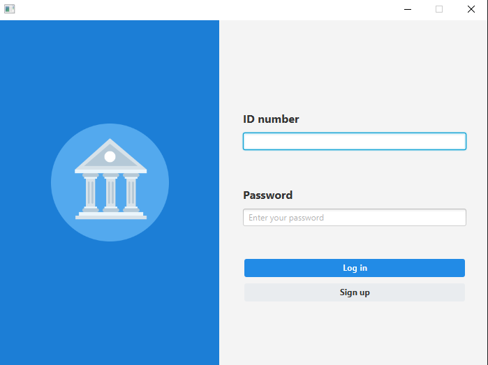
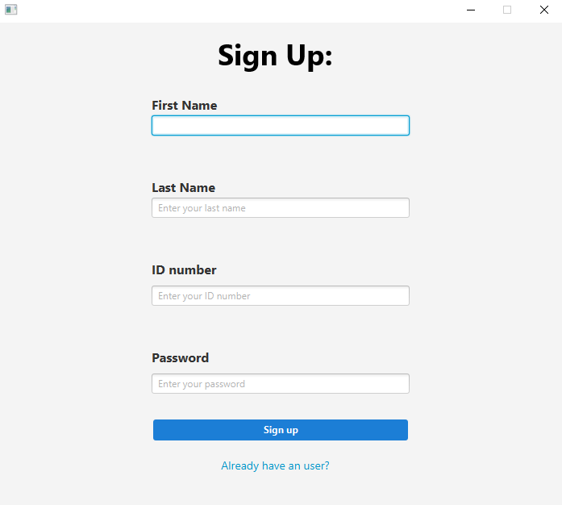
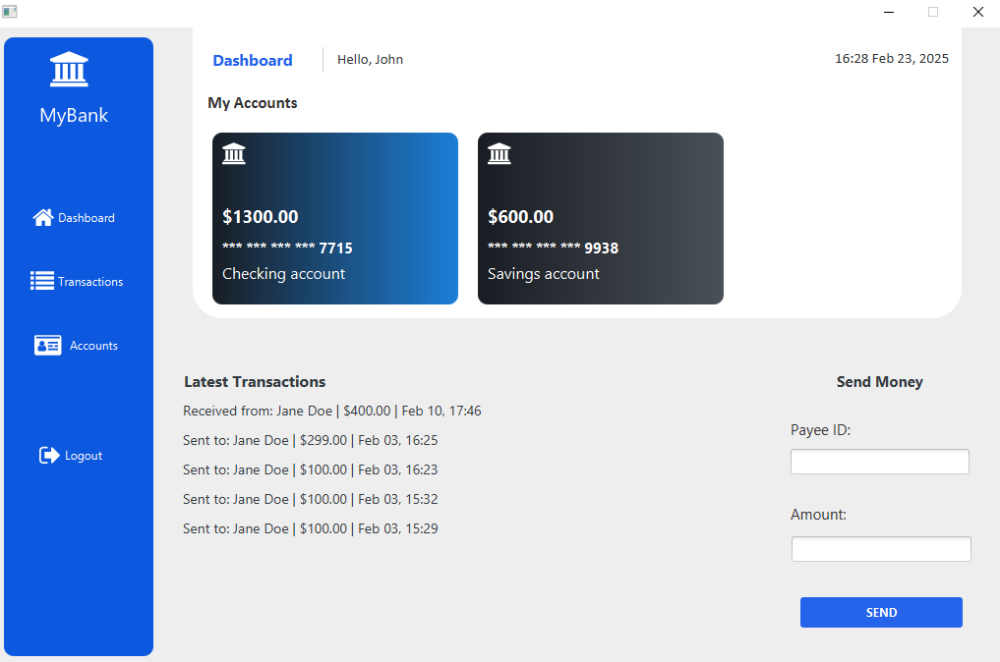
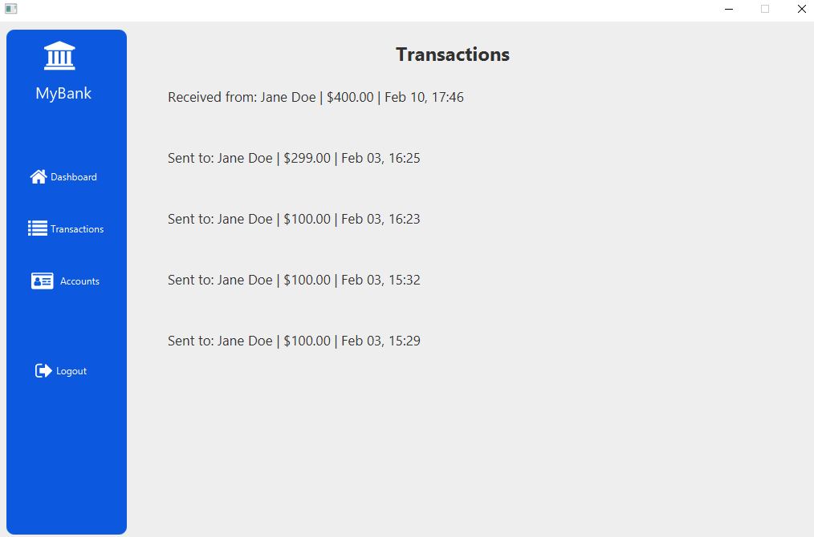
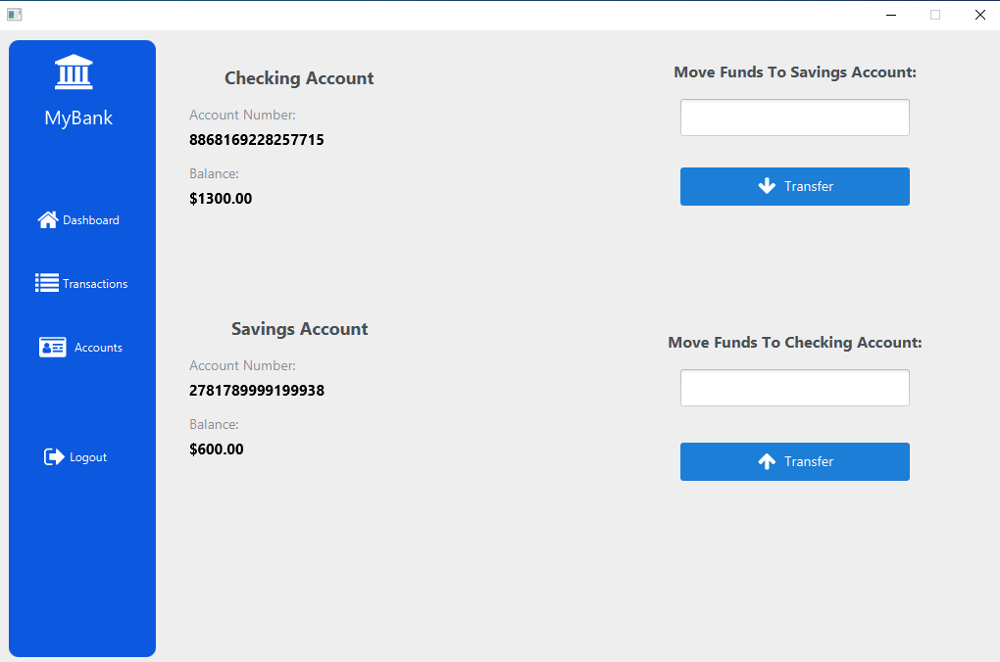

# Banking Management

## Screenshot

## Features

### User Authentication 
Users can signup and login using their ID and password.

### Account Management

#### Automatic Account Creation - Checking and savings accounts are created upon signup.
#### View Account Details - Users can view their account details in dashboard and accounts tab.
#### Transfer funds - Users can transfer funds between checking and savings accounts.

### Transaction Management

#### Send Money - Users can send money to other users.
#### Transaction History - Users can view all transactions and latest transactions.

### Database
Implemented JDBC to connect to SQL database. 

## Built with

* Java
* JavaFX (for GUI)
* JDBC
* MySQL
